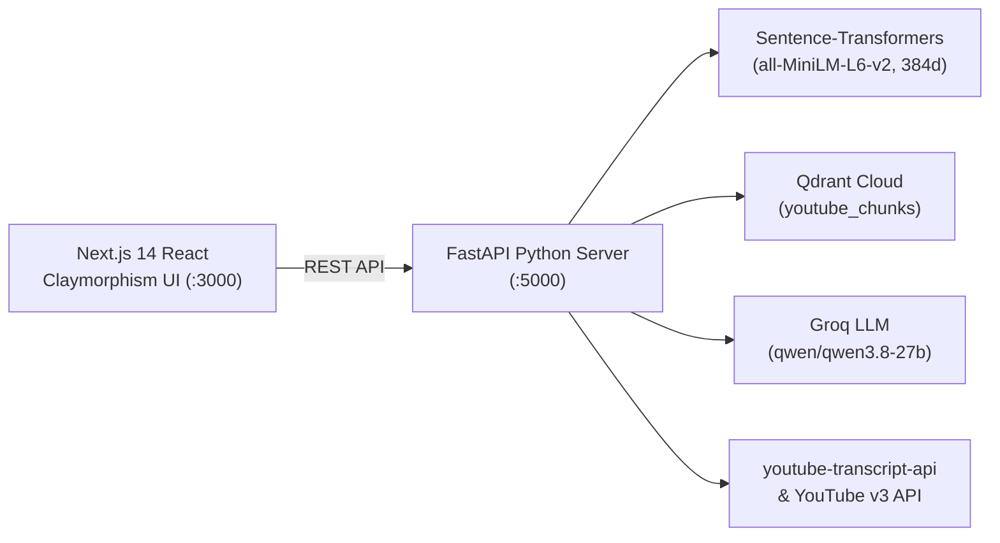

# 🎓 StudyTube AI — YouTube Playlist Study Assistant with RAG

An AI-powered study assistant that indexes entire YouTube playlists into **Qdrant Vector Database** and provides grounded, semantic Q&A using **Groq LLM** with exact video timestamp citations and interactive playback.

Built with a modern **Claymorphism React (Next.js)** frontend and a high-performance **Python (FastAPI)** backend.

---

## ✨ Features

- **⚡ Fast Playlist Ingestion**: Fetches playlists via YouTube API v3 and automatically extracts transcripts across languages.
- **🔍 Hybrid Vector Retrieval**: Semantic search powered by Sentence-Transformers (`all-MiniLM-L6-v2`, 384d) + Qdrant Cloud with cross-lingual phonetic keyword matching.
- **🛡️ Strict Relevance Gate**: Prevents hallucinations and false-positive video recommendations. If a topic is not in the course, no random videos are suggested.
- **🧠 Groq LLM Generation**: Fast, structured English educational explanations powered by Groq (`qwen/qwen3.8-27b`).
- **🎬 Interactive Player with Timestamp Seeking**: One-click jump to exact video moments (`▶ Jump to mm:ss`) with smooth scrolling and controlled autoplay.
- **🎨 Premium Claymorphism UI**: Soft pastel color palette, extruded 3D clay cards, and micro-interactions built with Vanilla CSS.

---

## 🏗️ Architecture



---

## 🚀 Quick Start

### 1. Clone the repository
```bash
git clone https://github.com/your-username/your-repo-name.git
cd your-repo-name
```

### 2. Configure Environment Variables
Copy `.env.example` to `.env` and add your API keys:
```bash
cp .env.example .env
```
Required keys:
- `GROQ_API_KEY`: Get a free key from [Groq Console](https://console.groq.com)
- `YOUTUBE_API_KEY`: Get a key from [Google Cloud Console](https://console.cloud.google.com)
- `QDRANT_URL` & `QDRANT_API_KEY`: Free cluster at [Qdrant Cloud](https://cloud.qdrant.io)

### 3. Start the Backend (Python FastAPI)
```bash
# Setup virtual environment
python -m venv .venv
# Activate:
# On Windows: .venv\Scripts\activate
# On macOS/Linux: source .venv/bin/activate

# Install dependencies
pip install -r server_py/requirements.txt

# Run server
uvicorn app.main:app --app-dir server_py --host 0.0.0.0 --port 5000 --reload
```

### 4. Start the Frontend (Next.js React)
```bash
cd client
npm install
npm run dev
```

Open [http://localhost:3000](http://localhost:3000) to start studying!

---

## 🌐 Deployment

- **Frontend**: Deploy `client` folder to [Vercel](https://vercel.com) with `NEXT_PUBLIC_API_URL`.
- **Backend**: Deploy `server_py` to [Render](https://render.com) or [Railway](https://railway.app).

---

## 📄 License
MIT License. Feel free to use and customize for your own learning!
